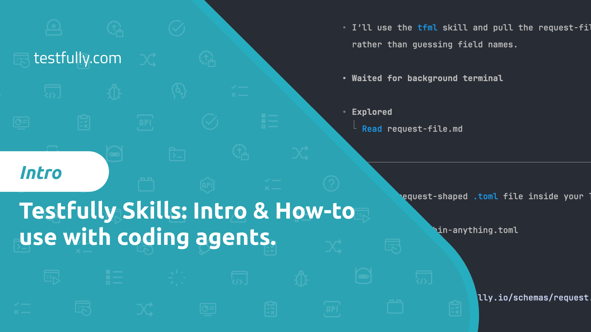

# Agent Skills

A collection of Testfully skills for AI coding agents. Skills are packaged
instructions and scripts that extend agent capabilities.

Skills follow the [Agent Skills](https://agentskills.io) format.

## Watch the Intro

[](https://www.youtube.com/watch?v=0x7hFb5w5h4)

Start with the
[Testfully agent skills intro video](https://www.youtube.com/watch?v=0x7hFb5w5h4)
to learn how these skills fit into your AI agent workflow, when to use each
skill, and how they help agents work with Testfully projects more effectively.

## Installation

```bash
npx skills add testfully/agent-skills
```

## Available Skills

| Name               | Description                                                                                   | Learn more                                     |
| ------------------ | --------------------------------------------------------------------------------------------- | ---------------------------------------------- |
| `testfully-cli`    | Skill to use Testfully CLI.                                                                   | [Open skill](skills/testfully-cli/SKILL.md)    |
| `testfully-script` | Skill to write Before Request or After Response scripts in Javascript and using Testfully API | [Open skill](skills/testfully-script/SKILL.md) |
| `tfml`             | Skill to write and maintain Testfully Markup Language (TFML) files.                           | [Open skill](skills/tfml/SKILL.md)             |

## Skill Structure

Skills are organised in `skills` directory, each in its own folder with the
following structure:

- `SKILL.md`: A markdown file describing the skill, its purpose, and usage
  instructions, following the [Agent Skills](https://agentskills.io) format.

## License

This project is licensed under the MIT License. See the [LICENSE](LICENSE) file
for details.
